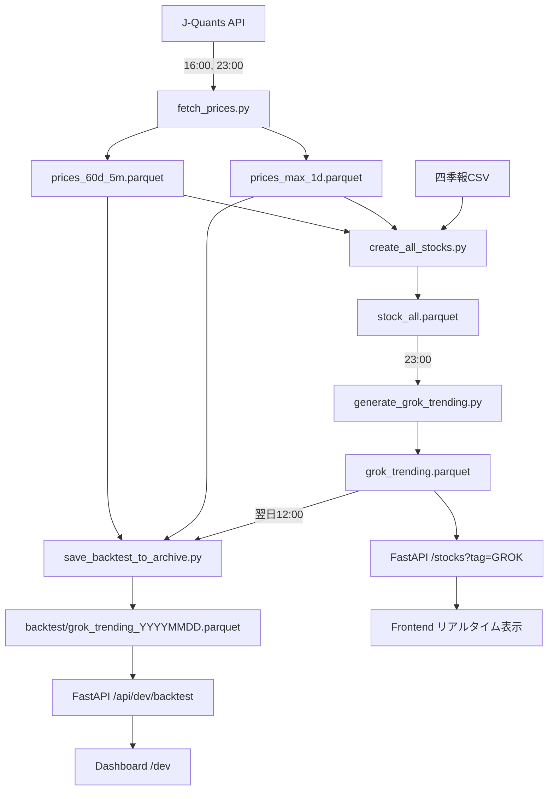

# 📋 Pipeline Roadmap - ベストプラクティス版

## 🎯 概要

このドキュメントは、株価データ取得・分析・バックテストの完全自動化パイプラインのロードマップです。
ECR (Amazon Elastic Container Registry) + ECS Scheduled Tasks での運用を想定しています。

---

## 🕐 実行スケジュール

### **12:00** - 前場終了後（バックテスト実行）
**目的**: 昨日選定したGROK銘柄のパフォーマンス検証

```bash
# ECRタスク: backtest-noon
python3 scripts/pipeline/save_backtest_to_archive.py
python3 scripts/pipeline/update_manifest.py
```

**処理内容**:
- 前日23:00選定のGROK銘柄（Top10-12）を読み込み
- 9:00寄付買い → 11:30前引け売却のリターンを計算
- バックテスト結果をアーカイブに保存
- S3マニフェスト更新

**入力データ**:
- `data/parquet/grok_trending.parquet` (前日23:00生成)
- `data/parquet/prices_max_1d.parquet` (寄付価格用)
- `data/parquet/prices_60d_5m.parquet` (11:30売却価格用)

**出力データ**:
- `data/parquet/backtest/grok_trending_YYYYMMDD.parquet`

---

### **16:00** - 後場終了後（全銘柄データ更新）
**目的**: 当日の確定データを取得・保存

```bash
# ECRタスク: update-afternoon
python3 scripts/pipeline/fetch_prices.py
python3 scripts/pipeline/create_all_stocks.py
python3 scripts/pipeline/update_manifest.py
```

**処理内容**:
1. **fetch_prices.py**: J-Quants APIから全銘柄の価格データ取得
   - 日足データ（max履歴）
   - 5分足データ（60日分）

2. **create_all_stocks.py**: 全銘柄のメタデータ + 価格データを統合
   - 四季報データ
   - テクニカル指標（RSI, ATR, ボリュームなど）
   - セクター情報

3. **update_manifest.py**: S3マニフェスト更新

**入力データ**:
- J-Quants API（リアルタイム取得）
- `data/parquet/stock_meta.parquet`

**出力データ**:
- `data/parquet/prices_max_1d.parquet` (更新)
- `data/parquet/prices_60d_5m.parquet` (更新)
- `data/parquet/stock_all.parquet` (更新)
- S3バケット全体

---

### **23:00** - 市場終了後（GROK選定 + 最終データ更新）
**目的**: 翌日の注目銘柄を選定 + その日の最終データ取得

```bash
# ECRタスク: update-night
python3 scripts/pipeline/fetch_prices.py
python3 scripts/pipeline/create_all_stocks.py
python3 scripts/pipeline/generate_grok_trending.py
python3 scripts/pipeline/update_manifest.py
```

**処理内容**:
1. **fetch_prices.py**: その日の最終価格データを再取得
   - 16時以降の追加データ反映
   - 翌日バックテスト用の最新データ準備

2. **create_all_stocks.py**: 全銘柄データ再構築

3. **generate_grok_trending.py**: AI駆動のGROK銘柄選定
   - xAI Grok APIでトレンド分析
   - SNSバズ分析（X/Twitter）
   - ニュース記事分析
   - テクニカル指標評価
   - 出来高・ボラティリティチェック
   - Top10-12銘柄を選定

4. **update_manifest.py**: S3マニフェスト更新

**入力データ**:
- J-Quants API（リアルタイム取得）
- `data/parquet/stock_all.parquet`
- SNS/ニュースデータ（API経由）

**出力データ**:
- `data/parquet/prices_max_1d.parquet` (最終更新)
- `data/parquet/prices_60d_5m.parquet` (最終更新)
- `data/parquet/stock_all.parquet` (最終更新)
- `data/parquet/grok_trending.parquet` ⭐ **翌日用**
- S3バケット全体

---

## 📂 Parquetファイル構造

```
data/parquet/
│
├── 📊 価格データ (J-Quants API取得)
│   ├── prices_max_1d.parquet          # 全銘柄の日足データ（最大履歴）
│   ├── prices_60d_5m.parquet          # 全銘柄の5分足データ（60日分）
│   └── prices_60d_15m.parquet         # 全銘柄の15分足データ（60日分）
│
├── 📋 銘柄メタデータ
│   ├── stock_meta.parquet             # 基本情報（コード、名称、市場、セクター）
│   ├── stock_all.parquet              # 統合データ（メタ + 最新価格 + テクニカル）
│   └── topix_core30.parquet           # TOPIX Core30銘柄リスト
│
├── 🤖 GROK関連（AI選定）
│   ├── grok_trending.parquet          # 当日選定の注目銘柄（Top10-12）
│   │                                  # ├─ ticker, stock_name
│   │                                  # ├─ selection_score, grok_rank
│   │                                  # ├─ reason (選定理由)
│   │                                  # └─ selected_time (23:00固定)
│   │
│   └── backtest/                      # バックテスト結果アーカイブ
│       ├── grok_trending_20251027.parquet
│       ├── grok_trending_20251028.parquet
│       └── ...
│           # 各ファイルの構造:
│           # ├─ ticker, stock_name
│           # ├─ selection_score, grok_rank
│           # ├─ reason, selected_time
│           # ├─ backtest_date
│           # ├─ buy_price (9:00寄付)
│           # ├─ sell_price (11:30前引け)
│           # ├─ phase1_return (%)
│           # └─ phase1_win (boolean)
│
├── 📈 スキャルピング分析
│   └── scalping_candidates.parquet    # デイトレード候補（短期ボラティリティ高）
│
└── 🔄 マニフェスト
    └── manifest.json                  # S3同期用メタデータ
```

---

## 🔄 データフロー全体像



---

## 🐳 ECRタスク定義

### **Task 1: backtest-noon** (12:00実行)
```yaml
Container:
  image: {AWS_ACCOUNT}.dkr.ecr.ap-northeast-1.amazonaws.com/stock-pipeline:latest
  command:
    - /bin/bash
    - -c
    - |
      python3 scripts/pipeline/save_backtest_to_archive.py && \
      python3 scripts/pipeline/update_manifest.py
  environment:
    - JQUANTS_REFRESH_TOKEN
    - JQUANTS_MAIL_ADDRESS
    - AWS_ACCESS_KEY_ID
    - AWS_SECRET_ACCESS_KEY
  memory: 2048
  cpu: 1024
```

### **Task 2: update-afternoon** (16:00実行)
```yaml
Container:
  image: {AWS_ACCOUNT}.dkr.ecr.ap-northeast-1.amazonaws.com/stock-pipeline:latest
  command:
    - /bin/bash
    - -c
    - |
      python3 scripts/pipeline/fetch_prices.py && \
      python3 scripts/pipeline/create_all_stocks.py && \
      python3 scripts/pipeline/update_manifest.py
  environment:
    - JQUANTS_REFRESH_TOKEN
    - JQUANTS_MAIL_ADDRESS
    - XAI_API_KEY
    - AWS_ACCESS_KEY_ID
    - AWS_SECRET_ACCESS_KEY
  memory: 4096
  cpu: 2048
```

### **Task 3: update-night** (23:00実行)
```yaml
Container:
  image: {AWS_ACCOUNT}.dkr.ecr.ap-northeast-1.amazonaws.com/stock-pipeline:latest
  command:
    - /bin/bash
    - -c
    - |
      python3 scripts/pipeline/fetch_prices.py && \
      python3 scripts/pipeline/create_all_stocks.py && \
      python3 scripts/pipeline/generate_grok_trending.py && \
      python3 scripts/pipeline/update_manifest.py
  environment:
    - JQUANTS_REFRESH_TOKEN
    - JQUANTS_MAIL_ADDRESS
    - XAI_API_KEY
    - AWS_ACCESS_KEY_ID
    - AWS_SECRET_ACCESS_KEY
  memory: 4096
  cpu: 2048
```

---

## ☁️ S3アップロードスケジュール

**S3バケット**: `stock-apic-data/parquet/`

### **12:00** - バックテストアーカイブのみ
```
backtest/grok_trending_YYYYMMDD.parquet  # 新規作成
manifest.json                            # 更新
```

**アップロード理由**: バックテスト結果を即座に公開し、ダッシュボードで確認可能に

---

### **16:00** - 全銘柄データの完全更新
```
prices_max_1d.parquet                    # 更新（後場確定データ）
prices_60d_5m.parquet                    # 更新（後場確定データ）
prices_60d_15m.parquet                   # 更新（後場確定データ）
stock_all.parquet                        # 更新（テクニカル指標含む）
stock_meta.parquet                       # 更新（必要に応じて）
topix_core30.parquet                     # 更新（必要に応じて）
scalping_candidates.parquet              # 更新（デイトレ候補）
manifest.json                            # 更新
```

**アップロード理由**:
- フロントエンドでの銘柄一覧表示に使用
- リアルタイムタブでの最新価格表示
- テクニカル分析データの提供

**データサイズ目安**: 約50-100MB（全ファイル合計）

---

### **23:00** - 全銘柄データ + GROK選定結果
```
prices_max_1d.parquet                    # 最終更新（当日終値確定）
prices_60d_5m.parquet                    # 最終更新（5分足最終）
prices_60d_15m.parquet                   # 最終更新（15分足最終）
stock_all.parquet                        # 最終更新（翌日用データ）
grok_trending.parquet                    # 新規作成（翌日の注目銘柄）
scalping_candidates.parquet              # 最終更新
manifest.json                            # 更新
```

**アップロード理由**:
- 翌日の取引準備（GROK銘柄公開）
- その日の最終確定データを保存
- 翌日12:00バックテスト用データ提供

**データサイズ目安**: 約50-100MB（全ファイル合計）

---

### S3アップロード対象外のファイル（ローカルのみ）

以下は開発・分析用でS3にはアップロードされません：

```
❌ backtest/grok_trending_20251001.parquet（古いバックテスト、ローテーション管理）
❌ notebooks/配下の分析ノートブック
❌ scripts/配下のスクリプトファイル
❌ data/shikiho.csv（四季報生データ）
```

**古いバックテストファイルの管理**:
- ローカル: 全履歴保持
- S3: 直近30日分のみアップロード（コスト削減）
- 長期保存が必要な場合はS3 Glacierへ移行

---

## 📊 バックテスト結果の活用

### **Dashboard**: https://ymnk.jp/dev
- 全期間の統計（総取引数、平均リターン、勝率）
- 日別パフォーマンス（最近10日間）
- Chart.js グラフ（リターン推移、勝率推移）
- 詳細ページへのリンク

### **Daily Detail**: https://ymnk.jp/dev/daily/2025-10-28
- その日の全GROK銘柄の結果
- 買値・売値・リターン・勝敗
- Top5パフォーマンス
- 個別銘柄ページへのリンク

---

## 🚀 実装ステータス

### ✅ 完了
- [x] 全パイプラインスクリプト作成
- [x] Parquetディレクトリ構造定義
- [x] バックテストAPI (`/api/dev/backtest/*`)
- [x] ダッシュボードUI (`/dev`, `/dev/daily/[date]`)
- [x] 環境変数対応（ローカル/本番切り替え）
- [x] エラーハンドリング（カラム欠損対応）

### 🔄 次のステップ
- [ ] Dockerfile作成（パイプライン用）
- [ ] ECRリポジトリ作成
- [ ] ECS Scheduled Tasks設定（3タスク）
- [ ] CloudWatch Logs設定
- [ ] SNS通知設定（エラー時）
- [ ] 本番環境テスト

---

## 📝 重要な注意事項

### **データ整合性**
- 12:00のバックテストは前日23:00選定のGROK銘柄を使用
- 価格データは前日16:00または23:00取得分を使用
- バックテスト実行日と価格データ日付の整合性を確認

### **API制限**
- J-Quants API: 1日のリクエスト制限あり（プランによる）
- xAI Grok API: レート制限に注意

### **エラー処理**
- 市場休日の場合は処理をスキップ
- データ欠損時はNullで保存（エラーで停止しない）
- ログを必ずCloudWatch Logsに送信

### **コスト最適化**
- 16:00と23:00で重複するfetch_pricesは最適化の余地あり
- S3ストレージコスト監視
- ECSタスク実行時間の最小化

---

## 🔗 関連ドキュメント

- [J-Quants API Documentation](https://jpx-jquants.com/)
- [xAI Grok API Documentation](https://docs.x.ai/)
- [AWS ECS Scheduled Tasks](https://docs.aws.amazon.com/AmazonECS/latest/developerguide/scheduled_tasks.html)

---

**最終更新**: 2025-10-28
**バージョン**: v1.0
**作成者**: Claude Code
