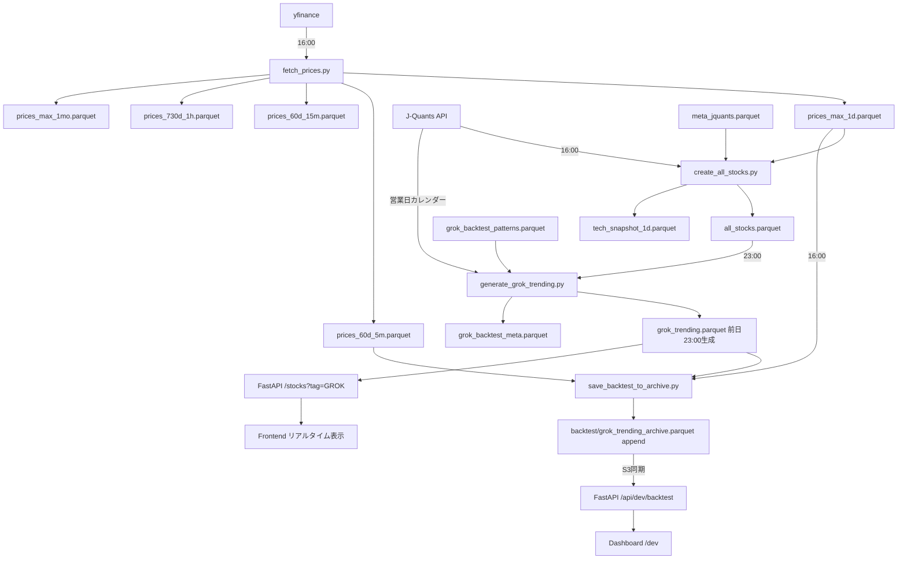

# 📋 Pipeline Roadmap - ベストプラクティス版

## 🎯 概要

このドキュメントは、株価データ取得・分析・バックテストの完全自動化パイプラインのロードマップです。
ECR (Amazon Elastic Container Registry) + ECS Scheduled Tasks での運用を想定しています。

---

## 🕐 実行スケジュール（2ワークフロー）

### **16:00** - 後場終了後（全銘柄データ更新 + バックテスト）

**目的**: 当日の確定データを取得・保存 + Phase1バックテスト実行

```bash
# ECRタスク: update-afternoon
python3 scripts/pipeline/fetch_prices.py
python3 scripts/pipeline/create_all_stocks.py
python3 scripts/pipeline/save_backtest_to_archive.py
python3 scripts/pipeline/update_manifest.py
```

**処理内容**:

1. **fetch_prices.py**: yfinance から全銘柄の価格データ取得

   - 日足データ（max 履歴）
   - 5 分足データ（60 日分）
   - 15 分足データ（60 日分）
   - 1 時間足データ（730 日分）
   - 月足データ（max 履歴）

2. **create_all_stocks.py**: 全銘柄のメタデータ + 価格データを統合

   - J-Quants API でメタデータ取得（銘柄情報、セクター情報）
   - テクニカル指標（RSI, ATR, ボリュームなど）

3. **save_backtest_to_archive.py**: GROK銘柄のPhase1バックテスト実行

   - 前日23:00選定のGROK銘柄を読み込み
   - 9:00始値（日足データ）→ 11:30以降の最初の有効価格（5分足データ）でリターン計算
   - バックテスト結果をアーカイブに追記（`data/parquet/backtest/grok_trending_archive.parquet`）

4. **update_manifest.py**: S3 マニフェスト更新

**入力データ**:

- yfinance（価格データ取得）
- J-Quants API（メタデータ・営業日カレンダー取得）
- `data/parquet/meta_jquants.parquet`
- `data/parquet/grok_trending.parquet`（バックテスト用）

**出力データ**:

- `data/parquet/prices_max_1d.parquet` (更新)
- `data/parquet/prices_max_1mo.parquet` (更新)
- `data/parquet/prices_730d_1h.parquet` (更新)
- `data/parquet/prices_60d_5m.parquet` (更新)
- `data/parquet/prices_60d_15m.parquet` (更新)
- `data/parquet/all_stocks.parquet` (更新)
- `data/parquet/tech_snapshot_1d.parquet` (更新)
- `data/parquet/backtest/grok_trending_archive.parquet` (追記)
- S3 バケット全体（アーカイブ含む）

---

### **23:00** - 市場終了後（GROK 銘柄選定 + 全銘柄データ更新）

**目的**: 翌営業日の注目銘柄を選定 → 最新価格データ取得

```bash
# ECRタスク: update-night
python3 scripts/pipeline/generate_grok_trending.py
python3 scripts/pipeline/create_all_stocks.py
python3 scripts/pipeline/fetch_prices.py
python3 scripts/pipeline/update_manifest.py
```

**処理内容**:

1. **generate_grok_trending.py**: AI 駆動の GROK 銘柄選定

   - xAI Grok API でトレンド分析
   - SNS バズ分析（X/Twitter）
   - ニュース記事分析
   - テクニカル指標評価
   - 出来高・ボラティリティチェック
   - Top10-15 銘柄を選定
   - J-Quants APIから営業日カレンダー取得（翌営業日の特定）
   - `grok_trending.parquet` を生成

2. **create_all_stocks.py**: 全銘柄データ再構築

   - J-Quants API でメタデータ取得
   - 新規GROK銘柄を `all_stocks.parquet` に統合
   - これにより fetch_prices.py が新GROK銘柄も含めて価格取得可能になる

3. **fetch_prices.py**: yfinance から全銘柄の最新価格データ取得

   - **新規GROK銘柄を含む**全銘柄の最新価格取得
   - 16時以降の価格変動を反映
   - 翌日のバックテスト用データ準備

4. **update_manifest.py**: S3 マニフェスト更新

**入力データ**:

- yfinance（最新価格データ取得）
- J-Quants API（メタデータ・営業日カレンダー取得）
- `data/parquet/grok_backtest_patterns.parquet`（バックテストフィードバック用）
- SNS/ニュースデータ（Grok API経由）

**出力データ**:

- `data/parquet/prices_max_1d.parquet` (最終更新)
- `data/parquet/prices_max_1mo.parquet` (最終更新)
- `data/parquet/prices_730d_1h.parquet` (最終更新)
- `data/parquet/prices_60d_5m.parquet` (最終更新)
- `data/parquet/prices_60d_15m.parquet` (最終更新)
- `data/parquet/all_stocks.parquet` (最終更新)
- `data/parquet/tech_snapshot_1d.parquet` (最終更新)
- `data/parquet/grok_trending.parquet` ⭐ **翌日用**（10-15銘柄選定）
- `data/parquet/grok_backtest_meta.parquet` (更新)
- S3 バケット全体

---

## 📂 Parquet ファイル構造

```
data/parquet/
│
├── 📊 価格データ (yfinance 取得)
│   ├── prices_max_1d.parquet          # 全銘柄の日足データ（最大履歴）
│   ├── prices_max_1mo.parquet         # 全銘柄の月足データ（最大履歴）
│   ├── prices_730d_1h.parquet         # 全銘柄の 1 時間足データ（730 日分）
│   ├── prices_60d_5m.parquet          # 全銘柄の 5 分足データ（60 日分）
│   └── prices_60d_15m.parquet         # 全銘柄の 15 分足データ（60 日分）
│
├── 📋 銘柄メタデータ (J-Quants API 取得)
│   ├── meta.parquet                   # 基本メタデータ
│   ├── meta_jquants.parquet           # J-Quants API メタデータ（銘柄情報、セクター情報）
│   └── all_stocks.parquet             # 統合データ（メタ + 最新価格 + テクニカル）
│
├── 📈 テクニカル分析
│   └── tech_snapshot_1d.parquet       # 日次テクニカル指標スナップショット
│
├── 🤖 GROK 関連（AI 選定）
│   ├── grok_trending.parquet          # 当日選定の注目銘柄（Top10-12）
│   │                                  # ├─ ticker, stock_name
│   │                                  # ├─ selection_score, grok_rank
│   │                                  # ├─ reason (選定理由)
│   │                                  # └─ selected_time (23:00 固定)
│   │
│   ├── grok_backtest_meta.parquet     # GROK バックテストメタデータ
│   │
│   └── backtest/                      # ✅ S3同期（Dashboard表示用）
│       └── grok_trending_archive.parquet  # append-only アーカイブ
│           # 構造:
│           # ├─ ticker, stock_name
│           # ├─ selection_score, grok_rank
│           # ├─ reason, selected_time
│           # ├─ backtest_date
│           # ├─ buy_price (9:00 寄付)
│           # ├─ sell_price (11:30以降の最初の有効価格)
│           # ├─ phase1_return (小数、例: 0.0523 = 5.23%)
│           # └─ phase1_win (boolean)
│
└── 🔄 マニフェスト
    └── manifest.json                  # S3 同期用メタデータ
```

**重要**: S3 には `parquet/` 以下のディレクトリ構造がそのまま同期されます。
`backtest/grok_trending_archive.parquet` は S3 の `s3://stock-api-data/parquet/backtest/` に配置されます。

---

## 🔄 データフロー全体像



---

## 🐳 ECR タスク定義

### **Task 1: update-afternoon** (16:00 実行)

```yaml
Container:
  image: {AWS_ACCOUNT}.dkr.ecr.ap-northeast-1.amazonaws.com/stock-pipeline:latest
  command:
    - /bin/bash
    - -c
    - |
      python3 scripts/pipeline/fetch_prices.py && \
      python3 scripts/pipeline/create_all_stocks.py && \
      python3 scripts/pipeline/save_backtest_to_archive.py && \
      python3 scripts/pipeline/update_manifest.py
  environment:
    - JQUANTS_REFRESH_TOKEN
    - JQUANTS_MAIL_ADDRESS
    - AWS_ACCESS_KEY_ID
    - AWS_SECRET_ACCESS_KEY
  memory: 4096
  cpu: 2048
```

### **Task 2: update-night** (23:00 実行)

```yaml
Container:
  image: {AWS_ACCOUNT}.dkr.ecr.ap-northeast-1.amazonaws.com/stock-pipeline:latest
  command:
    - /bin/bash
    - -c
    - |
      python3 scripts/pipeline/generate_grok_trending.py && \
      python3 scripts/pipeline/create_all_stocks.py && \
      python3 scripts/pipeline/fetch_prices.py && \
      python3 scripts/pipeline/update_manifest.py
  environment:
    - JQUANTS_REFRESH_TOKEN
    - JQUANTS_MAIL_ADDRESS
    - XAI_API_KEY
    - AWS_ACCESS_KEY_ID
    - AWS_SECRET_ACCESS_KEY
  memory: 4096
  cpu: 2048
```

---

## ☁️ S3 アップロードスケジュール

**S3 バケット**: `stock-api-data/parquet/`

**重要**: S3 には `parquet/` 以下のディレクトリ構造がそのまま同期されます（`backtest/` サブディレクトリ含む）。

### **16:00** - 全銘柄データの完全更新 + バックテスト実行

```
prices_max_1d.parquet                    # 更新（後場確定データ、約 13MB）
prices_max_1mo.parquet                   # 更新（月足データ、約 0.8MB）
prices_730d_1h.parquet                   # 更新（1 時間足データ、約 4.4MB）
prices_60d_5m.parquet                    # 更新（5 分足データ、約 2.9MB）
prices_60d_15m.parquet                   # 更新（15 分足データ、約 1.2MB）
meta.parquet                             # 更新（必要に応じて、約 8KB）
meta_jquants.parquet                     # 更新（必要に応じて、約 114KB）
all_stocks.parquet                       # 更新（テクニカル指標含む、約 15KB）
tech_snapshot_1d.parquet                 # 更新（日次テクニカル指標、約 22KB）
manifest.json                            # 更新（約 5KB）
```

**アップロード理由**:

- フロントエンドでの銘柄一覧表示に使用
- リアルタイムタブでの最新価格表示
- テクニカル分析データの提供
- バックテストアーカイブもS3にアップロード（Dashboard表示用）

**データサイズ目安**: 約 23MB + アーカイブファイル（日々増加、Parquet圧縮で効率的）

---

### **23:00** - 全銘柄データ + GROK 選定結果

```
prices_max_1d.parquet                    # 最終更新（当日終値確定、約 13MB）
prices_max_1mo.parquet                   # 最終更新（月足データ、約 0.8MB）
prices_730d_1h.parquet                   # 最終更新（1 時間足データ、約 4.4MB）
prices_60d_5m.parquet                    # 最終更新（5 分足最終、約 2.9MB）
prices_60d_15m.parquet                   # 最終更新（15 分足最終、約 1.2MB）
meta.parquet                             # 最終更新（必要に応じて、約 8KB）
meta_jquants.parquet                     # 最終更新（必要に応じて、約 114KB）
all_stocks.parquet                       # 最終更新（GROK銘柄含む、約 15KB）
tech_snapshot_1d.parquet                 # 最終更新（日次テクニカル指標、約 22KB）
grok_trending.parquet                    # 新規作成（翌日の注目銘柄、約 19KB）
grok_backtest_meta.parquet               # 更新（GROK バックテストメタ、約 2KB）
manifest.json                            # 更新（約 5KB）
```

**アップロード理由**:

- 翌日のバックテスト準備（最新価格データ）
- GROK 銘柄選定（all_stocks.parquet に反映）
- フロントエンドでの表示用

**データサイズ目安**: 約 23MB（全ファイル合計）

---

### S3 アップロード対象外のファイル（ローカルのみ）

以下はローカルの `data/parquet/` 内に存在しますが、S3 にはアップロードされません：

```
❌ backtest_results/ ディレクトリ
❌ strategy_comparison/ ディレクトリ
❌ test/ ディレクトリ
❌ grok_prompt_final.txt
❌ grok_prompt_refined.txt
❌ meta.parquet.backup_*（バックアップファイル）
❌ backtest/grok_trending_YYYYMMDD.parquet（旧形式の日次ファイル、削除可能）
```

**バックテスト結果の管理**:

- **ローカル**: `data/parquet/backtest/grok_trending_archive.parquet` に全履歴を保持（append-only）
- **S3**: アーカイブファイルを同期（`s3://stock-api-data/parquet/backtest/grok_trending_archive.parquet`）
- **Dashboard**: `https://ymnk.jp/dev` でS3データを参照

---

## 📊 バックテスト結果の活用

### **Dashboard**: https://ymnk.jp/dev

- 全期間の統計（総取引数、平均リターン、勝率）
- 日別パフォーマンス（最近 10 日間）
- Chart.js グラフ（リターン推移、勝率推移）
- 詳細ページへのリンク

### **Daily Detail**: https://ymnk.jp/dev/daily/2025-10-28

- その日の全 GROK 銘柄の結果
- 買値・売値・リターン・勝敗
- Top5 パフォーマンス
- 個別銘柄ページへのリンク

---

## 🚀 実装ステータス

### ✅ 完了

- [x] 全パイプラインスクリプト作成
- [x] yfinanceベースの価格データ取得
- [x] J-Quants APIでメタデータ取得
- [x] Phase1バックテスト実装（9:00→11:30）
- [x] Parquet ディレクトリ構造定義
- [x] バックテスト API (`/api/dev/backtest/*`)
- [x] ダッシュボード UI (`/dev`, `/dev/daily/[date]`)
- [x] 環境変数対応（ローカル/本番切り替え）
- [x] エラーハンドリング（カラム欠損対応）
- [x] 2ワークフロー設計（16:00 + 23:00）

### 🔄 次のステップ

- [ ] Dockerfile 作成（パイプライン用）
- [ ] ECR リポジトリ作成
- [ ] ECS Scheduled Tasks 設定（2 タスク：16:00, 23:00）
- [ ] CloudWatch Logs 設定
- [ ] SNS 通知設定（エラー時）
- [ ] 本番環境テスト

---

## 📝 重要な注意事項

### **データ整合性**

- 16:00 のバックテストは前日 23:00 選定の GROK 銘柄を使用
- 価格データは当日 16:00 取得（yfinance）
- バックテスト実行日と価格データ日付の整合性を確認

### **API 制限**

- yfinance: レート制限に注意（全銘柄一括取得でスレッド並列化）
- J-Quants API: メタデータと営業日カレンダーのみ使用（1日のリクエスト制限内）
- xAI Grok API: レート制限に注意

### **エラー処理**

- 市場休日の場合は処理をスキップ
- データ欠損時は Null で保存（エラーで停止しない）
- ログを必ず CloudWatch Logs に送信

### **コスト最適化**

- 16:00 と 23:00 の両方で価格データ取得（GROK銘柄がall_stocks.parquetに反映されるため必要）
- S3 ストレージコスト監視（アーカイブはParquet圧縮で効率的）
- ECS タスク実行時間の最小化
- バックテストアーカイブをS3に同期（append-only、日次ファイルは不要）

---

## 🔗 関連ドキュメント

- [J-Quants API Documentation](https://jpx-jquants.com/)
- [xAI Grok API Documentation](https://docs.x.ai/)
- [AWS ECS Scheduled Tasks](https://docs.aws.amazon.com/AmazonECS/latest/developerguide/scheduled_tasks.html)

---

---

**最終更新**: 2025-10-28
**バージョン**: v2.0（2ワークフロー版）
**作成者**: Claude Code
**ステータス**: ✅ 実装ベースで修正完了
